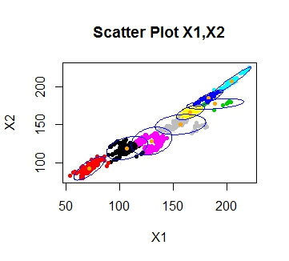
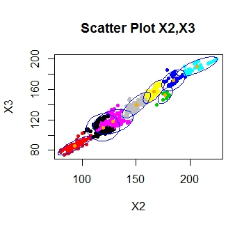

# Clustering-Gmeans
This project implements an algorithm to find the optimal number of clusters in K-means clustering; GMEANS

This project aimed at studying different clustering algorithms and identifying various limitations of each of them. We also studied different measures to overcome the limitations of the algorithms and alternative techniques and distance measures useful for clustering.

K-means is a very simple and popular algorithm. However, it suffers from many problems like bias towards globular clusters, hyper-parameter K(number of clusters), susceptible to initial choice of centroids, empty clusters etc. We studied the techniques to overcome these limitations and implemented the technique to find out the optimal number of clusters given the data. We implemented the Gmeans algorithm which recursively partitions data into clusters and checks for the normality of the data distributed around the center.

Other techniques useful in overcoming the limitations are Bisecting kmeans, Xmeans, and a strategy to choose the initial centroids among the data points instead of complete random choice to avoid empty clusters. We also studied hierarchical clustering and density based clustering (DBSCAN).

  
  

  

